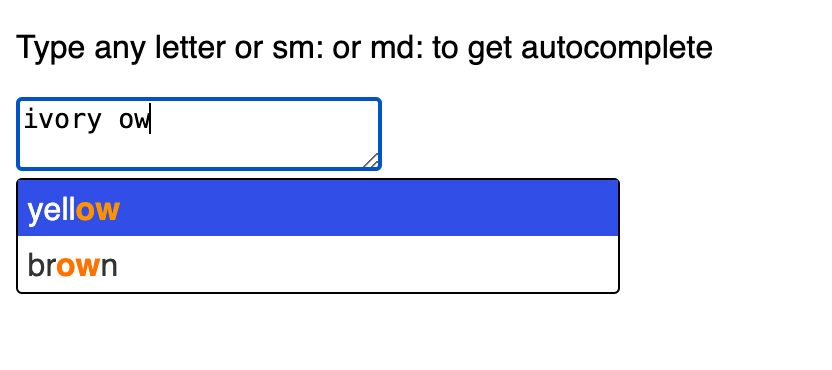

# Custom multiple autocomplete

This is modified solution from this website: https://phuoc.ng/collection/mirror-a-text-area/add-autocomplete-to-your-text-area/

Updated to get extra features:

1. Autocomplete prefix
2. To trigger autocomplete apply with Enter, Tab, Right Arrow "→"

# Change triggers

Update prefixes.js

```export const prefixes = [" ", "sm:", "md:"];
```

# Change autocomplete aka suggestions

```export const suggestions = [
    "white",
    "yellow",
    "blue",
    "red",
    "green",
    "black",
    "brown",
    "azure",
    "ivory",
    "teal",
];
```

# Preview




